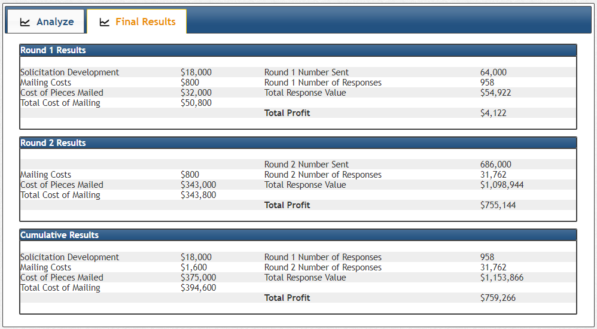

* Team-lead gitlab id: rsm-n1gong
* Group number: 12
* Group name: Team 12
* Team member names: Nawen Gong, Zichen Zhang, Zheng Shan, Xinyue Tao

```{r r_setup, include = FALSE}
## initial settings
knitr::opts_chunk$set(
  comment = NA,
  echo = TRUE,
  error = TRUE,
  cache = FALSE,
  message = FALSE,
  dpi = 96,
  warning = FALSE
)

## width to use when printing tables etc.
options(
  width = 250,
  scipen = 100,
  max.print = 5000,
  stringsAsFactors = FALSE
)
```

<style>
.table {
  width: auto;
}
ul, ol {
  padding-left: 18px;
}
pre, code, pre code {
  overflow: auto;
  white-space: pre;
  word-wrap: normal;
  background-color: #ffffff;
}
</style>

## Setup

Please complete this R-markdown document by answering the questions in `pfg-bank.pdf` on Dropbox (week10/readings/). The code block below will load the historical data from exhibits 1 and 2. Please DO NOT change the code used to load the data. Create an HTML (Notebook) file with all your results and comments and push both the Rmarkdown and HTML file to GitLab when you are done. All analysis results MUST be reproducible (i.e., the TA and I must be able to recreate the HTML from the R-markdown file without changes or errors).

```{r include=FALSE}
fp <- radiant.data::find_dropbox()
EX1 <- readxl::read_excel(file.path(fp, "MGTA455-2019/data/exhibits.xlsx"), sheet = "exhibit1")
EX2 <- readxl::read_excel(file.path(fp, "MGTA455-2019/data/exhibits.xlsx"), sheet = "exhibit2")
```

```{r include=FALSE}
library(tidyverse)
library(radiant)
```


## Question answers  


**Q1. Why does Lifetime Customer Value vary with BK score? Why does Lifetime Customer Value vary with product? (See Exhibit 2 to help answer these questions)**  

The BK score is a measure of risk —— the higher the score, the more likely that person was to default on a financial obligation. Thus, it is clear to see that person with lower BK score will have higher CLV. 

Besides that, CLV also vary with product.

1) the higher the APR, the higher the CLV:
APR was the rate of interest charged on outstanding balance. So, the higher APR which means the more finance charges the customer accrued, will definitely leads to higher CLV.

2) the higher the annual fee, the higher the CLV:
Annual fee is a key determinant of the credit card's profitability, so higher annual fee will contribute to higher CLV.

3) the variable-rate products enjoy higher CLV than the fixed rate products:
The advantage of a variable-rate card is that bank could pass along most of the interest-rate risk to the customers. So PFG bank will undoubtedly prefer the variable-rate products, and this preference is accounted for in the CLV estimates.


**Q2. Are predictive models estimated on historical data useful in this case? If so, why? If not, why not?**

Yes. The historical model helped us to get predicted response probability which was then used to filter out products/BK pairs we don't think should be mailed. Without the historical data, we would have to mail based on either 12~18 partial factorial product combinations or mail all 36 combinations, making the test round 1 inefficient. With the helpful historical data, we first projected to 1.52million population, then trained the logistic model and finally predicted on 18 products to filter out 2 combinations in round 1. In this way, we saved customers for the final round and reduced cost.


**Q3. Is there a “best product” that will likely be preferred by all customers?**  

Yes. Based on our round 1 result, we were able to train a model that later helped us to discover the very product that is profitable among all BK scores:  

apr: 14.9; 
Fixed_var: Var;	
Annual_fee: 0.  


**Q4. Describe and justify your testing strategy.**   

For round one, we don't have any reliable information to pick products to mail, therefore, we need to figure out some models or frameworks to rely on. Since we have the historical response data, we can scale the data into 1.52 million customers so that to train a relatively robust model; however, we're not sure by how much can we trust the model outcome to select product. With the massive 1.52 million predictions, we feel overwhelmed in picking the least products possible; therefore, we combined our strategy with experiment design to provide us with 18 most representative product combinations. We fit our model on the 18 combinations to get the response probability, multiplying the ltv to get the expected LTV. We evaluate the expected ltv with mailing cost of 0.5, if it is less than 0.5, we reject the product. In the end we picked 16 products to send in round one. For each combination selected, we mail 4000 people, that is 32,000 people in total and we got the round 1 profit of $4,122.

For round two, we now have the true information to reflect the product/BK response rate, so we are able to train another model using the newly projected population based on round one result. Then fit the model on the full combination to select products. Since we won't be using experiment design anymore, we now added interactions in the logistic model for the prediction. With the prediction, we pick the product that generate the highest expected LTV for each BK score. Finally, we realized that there is one product that can provide the highest expected ltv for all scores, which is apr: 14.9/ Fixed_var: Var/ Annual_fee: 0. 

We mail this offer to all the customers left, and get the round 2 profit of $755,144.


### Highest resp?  

```{r echo=FALSE}
EX1 %>% 
  mutate(respct = resp / nr_mailed) %>% 
  arrange(desc(respct))
```


## Scale EX1 to the full population based on resp rate

```{r echo=FALSE}
## change variable type
EX1 <- mutate_at(EX1, .vars = vars(bk_score), .funs = as_factor)
sum(EX1$resp)/sum(EX1$nr_mailed)
```  


```{r include=FALSE}
## Gather columns
EX1_gathered <- gather(EX1, open, Num_cus, non_resp, resp, factor_key = TRUE)
## register the new dataset
register("EX1_gathered", "EX1")

## Create data from a table
EX1_gathered_dat <- select(EX1_gathered, apr, fixed_var, annual_fee, visamc, nr_mailed, bk_score, open, Num_cus) %>%
  table2data("Num_cus")
## register the new dataset
register("EX1_gathered_dat", "EX1_gathered")

```


### Build logitistic model based on the sim.dataset

```{r echo=FALSE}
result <- logistic(
  EX1_gathered_dat, 
  rvar = "open", 
  evar = c("apr", "fixed_var", "annual_fee", "bk_score"), 
  lev = "resp", 
  check = "standardize"
)
summary(result)
```  


### Predict on Ex2 

```{r include=FALSE}
## change variable type
EX2 <- mutate_at(EX2, .vars = vars(annual_fee), .funs = as_factor)
## change variable type
EX2 <- mutate_at(EX2, .vars = vars(apr), .funs = as_factor)
## Gather columns
EX2_gathered <- gather(EX2, BK, LTV, ltv150, ltv200, ltv250, factor_key = TRUE)
## register the new dataset
register("EX2_gathered", "EX2")
## create new variable(s)
EX2_gathered <- mutate(EX2_gathered, bk_score = ifelse(BK == 'ltv150', 150, ifelse(BK == 'ltv200', 200, 250)))
## change variable type
EX2_gathered <- mutate_at(EX2_gathered, .vars = vars(bk_score), .funs = as_factor)
```


```{r include=FALSE}
pred_ex2 <- predict(result, EX2_gathered)
```  

### Predict the response probability using logit model  

```{r echo=FALSE}
EX2_gathered$pred <- pred_ex2$Prediction
head(EX2_gathered)
```  


### Get "expected LTV" = response probability * estimated LTV  

```{r echo=FALSE}
EX2_gathered$exp_ltv <- EX2_gathered$pred * EX2_gathered$LTV
head(EX2_gathered)
```  

```{r echo=FALSE}
EX2_gathered <- EX2_gathered %>% 
  arrange(apr, fixed_var, annual_fee)
EX2_gathered
```


### Using 0.5(cost per mail) / ltv as break-even  

```{r echo=FALSE}
EX2_gathered <- EX2_gathered %>% 
  mutate(BE = 0.5/LTV) %>% 
  mutate(mail = ifelse(pred > BE, 1, 0))
head(EX2_gathered)
```  


### Customer / offer pairs don't mail based on BE  

```{r echo=FALSE}
EX2_gathered %>% 
  filter(mail == 0)
```


### Get 18 combination of offers

```{r echo=FALSE}
part_fac <- read_csv("part_factorial.csv") 
part_fac$apr <- factor(part_fac$apr)
part_fac$Annual_fee <- factor(part_fac$Annual_fee)
part_fac$BK <- factor(part_fac$BK)
head(part_fac)
```  


### Join the 18 offers with 36 combiantions from Ex2 to get LTV of each customer

```{r echo=FALSE}
all_pred <- part_fac %>% 
  left_join(EX2_gathered, by = c("apr", "Finxed_var" = "fixed_var", "Annual_fee" = "annual_fee", "BK" = "bk_score"))

names(all_pred)[3] <- "Fixed_var"

head(all_pred)
```  

> We pick offers using Break-even Rate = 0.5/LTV, filtered out 2 offers and email the rest offer to 4000 of each BK score, here's our ourcome

```{r echo=FALSE}
round_one_res <- read_csv("round_one_gathered.csv")
# round_one_res <- select(round_one_res, c(1,2,3,4,6,7))
head(round_one_res)
```

### using the round one outcome, we are able to project the dataset to the whole population and to train the new logit model with interactions and then to predict on the all combination offers.

```{r include=FALSE}
EX2_gathered2 <- read_csv("EX2_gathered2.csv")
EX2_gathered2 <- EX2_gathered[,c(2,3,4,6,7)]
names(EX2_gathered2)[2] <- "Fixed_var"
names(EX2_gathered2)[3] <- "Annual_fee"
names(EX2_gathered2)[5] <- "BK"
EX2_gathered2$Fixed_var <- ifelse(EX2_gathered2$Fixed_var == "Variable", "Var", "Fixed")

full_comb_pred <- read_csv('EX2_gathered2_dat.csv')
full_comb_pred <- full_comb_pred %>% arrange(BK, desc(pred_fromr1), desc(exp_ltv))
head(full_comb_pred)
```  


### For each bk score, we pick only the highest expected ltv product to mail:
*apr: 14.9; Fixed_var:	Var;	Annual_fee: 0*  

```{r echo=FALSE}
full_comb_pred[c(1, 13, 25),]
```





